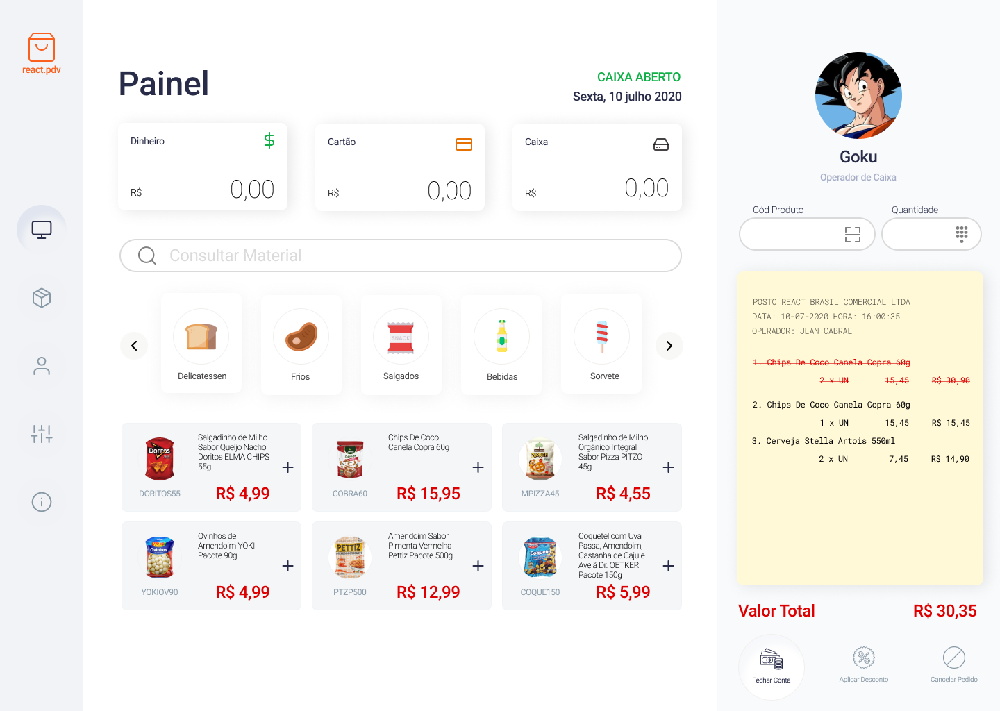

<h1 align="center">
	
</h1>

<h3 align="center">
  React PDV/POS
</h3>

<p align="center">POS (Point of Sale System) built with ReactJS</p>

<p align="center">
  

  

  <a href="https://github.com/jeancabral/react-pdv/commits/master">
    
  </a>

  <a href="https://github.com/jeancabral/react-pdv/issues">
    
  </a>

  
</p>

<p align="center">
  <a href="#-about-the-project">About the project</a>&nbsp;&nbsp;&nbsp;|&nbsp;&nbsp;&nbsp;
  <a href="#-technologies">Technologies</a>&nbsp;&nbsp;&nbsp;|&nbsp;&nbsp;&nbsp;
  <a href="#-getting-started">Getting started</a>&nbsp;&nbsp;&nbsp;|&nbsp;&nbsp;&nbsp;
  <a href="#-how-to-contribute">How to contribute</a>&nbsp;&nbsp;&nbsp;|&nbsp;&nbsp;&nbsp;
  <a href="#-license">License</a>
</p>

## 👨🏻‍💻 About the project

- <p style="color: red;">POS (Point of Sale System) built with ReactJS</p>

- [Demo @ netlify](https://5f1334983bb412d8a17342ed--react-pos.netlify.app/)
- [Template @ Figma](https://www.figma.com/file/hjFds4JruLo2SWobQbb2Ss/React-PDV-Frontend?node-id=24%3A2)

<h1 align="center">
	
</h1>

## 🚀 Technologies

Technologies that I used to develop this web client

- [ReactJS](https://reactjs.org/)
- [TypeScript](https://www.typescriptlang.org/)
- [Eslint](https://eslint.org/)
- [Prettier](https://prettier.io/)
- [EditorConfig](https://editorconfig.org/)

## 💻 Getting started

### Requirements

**Clone the project and access the folder**

```bash
$ git clone https://github.com/jeancabral/react-pdv.git && cd react-pdv
```

**Follow the steps below**

```bash
# Install the dependencies
$ yarn

# Be sure the file 'src/services/api.ts' have the IP to your API

# Start the client
$ yarn start
```

## Contributors

<a href="https://twiiter.com/jeancabral">

</a>
<a href="https://github.com/pablohenriqueop">

</a>

## 🤔 How to contribute

**Make a fork of this repository**

```bash
# Fork using GitHub official command line
# If you don't have the GitHub CLI, use the web site to do that.

$ gh repo fork jeancabral/react-pdv
```

**Follow the steps below**

```bash
# Clone your fork
$ git clone your-fork-url && cd react-pdv

# Create a branch with your feature
$ git checkout -b my-feature

# Make the commit with your changes
$ git commit -m 'feat: My new feature'

# Send the code to your remote branch
$ git push origin my-feature
```

After your pull request is merged, you can delete your branch

## 📝 License

This project is licensed under the MIT License - see the [LICENSE](LICENSE) file for details.

---

Made with 💜 by Jean 👋 [See my linkedin](https://www.linkedin.com/in/jeancabralbr//)